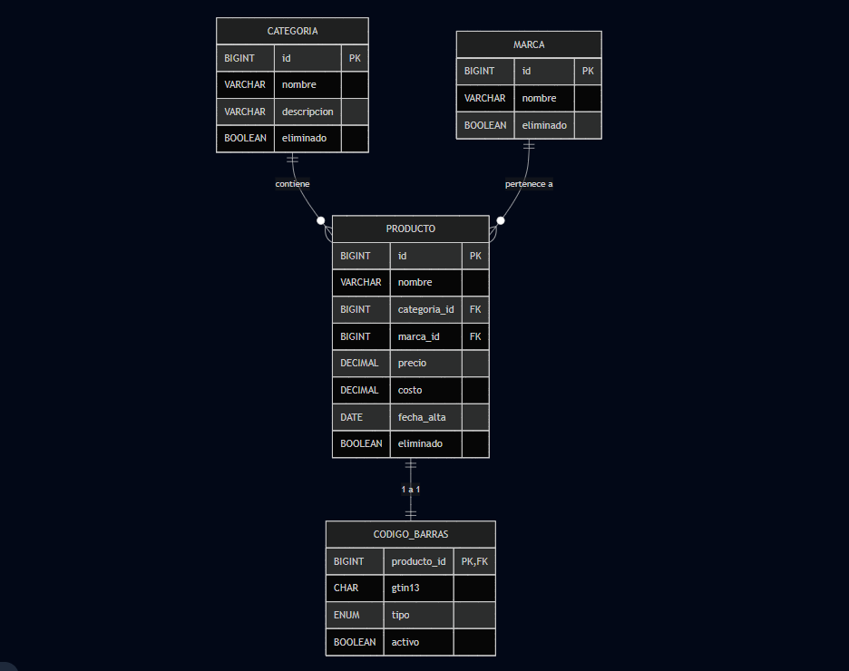

# Trabajo Final Integrador — Catálogo de Productos con Código de Barras

## Introducción general

El **Trabajo Final Integrador** articula las materias **Bases de Datos I** y **Programación II**, con el propósito de consolidar los conocimientos teóricos y prácticos adquiridos durante el cuatrimestre. El proyecto consiste en el diseño, implementación, carga masiva, análisis y aseguramiento de un sistema relacional orientado a la **gestión de un catálogo de productos con código de barras (GTIN-13)**.  

A lo largo del desarrollo se aplicaron principios de modelado conceptual y lógico, normalización, diseño de claves, creación de restricciones de integridad, generación masiva de datos, medición de rendimiento, seguridad de acceso y manejo de concurrencia mediante transacciones y control de aislamiento.  

El esquema resultante, denominado `producto_barras`, fue probado en MySQL 8.0 y complementado con componentes Java (JDK 17) que interactúan mediante JDBC y consultas parametrizadas (`PreparedStatement`).  

## Configuración de la conexión JDBC

La aplicación Java lee sus parámetros de conexión desde `java/src/main/resources/database.properties`. El archivo se versiona con valores funcionales para un servidor MySQL/MariaDB local:

```
jdbc.url=jdbc:mysql://localhost:3306/producto_barras
jdbc.user=app_user
jdbc.password=TPIntegrador2025!
jdbc.driverClassName=com.mysql.cj.jdbc.Driver
```

> **Nota:** el usuario `app_user` y la clave `TPIntegrador2025!` se generan con el script [`scripts/E4_seguridad.sql`](scripts/E4_seguridad.sql) y tienen permisos de solo lectura sobre las vistas expuestas a la aplicación. Ejecute previamente los scripts de `schema.sql`, `sample_data.sql` y `E4_seguridad.sql` (o sus equivalentes en el entorno objetivo) para recrear el esquema `producto_barras` con los privilegios adecuados.

### Personalización por entorno

- **Variables de entorno**: sobreescriba cualquier clave agregando el prefijo `DB_` en tiempo de ejecución (`DB_JDBC_URL`, `DB_JDBC_USER`, `DB_JDBC_PASSWORD`, etc.). También puede forzar un archivo alternativo estableciendo `DB_PROPERTIES=database.dev.properties`. El `AppMenu` lee estos valores antes de cargar el archivo de propiedades.
- **Archivo específico por entorno**: cree una copia de `database.properties` (por ejemplo, `database.dev.properties`) y ejecútela con `-Ddb.properties=database.dev.properties` para que `DatabaseConnection` use esa variante.
- **Propiedades del sistema**: cualquier clave puede sobreescribirse con el prefijo `db.` (por ejemplo, `-Ddb.jdbc.url=jdbc:mysql://servidor:3306/producto_barras`).
- **Contenedores o servicios remotos**: ajuste `jdbc.url` para apuntar al host/puerto reales (`jdbc:mysql://<host>:<puerto>/producto_barras`) y asegúrese de que el usuario tenga permisos de conexión desde su origen (`'app_user'@'%'` si es necesario).

Si se opta por utilizar otro usuario, modifique el archivo de propiedades, las variables de entorno o las propiedades del sistema y actualice también los grant otorgados en el script de seguridad. Recuerde habilitar `allowPublicKeyRetrieval=true` y `useSSL=false` en la URL cuando el servidor requiera autenticación por contraseña sobre conexiones no cifradas.

La presente memoria técnica detalla cada etapa, citando los **scripts SQL y programas Java** correspondientes, incorporando evidencias experimentales y reflexiones técnicas.  

---

## Etapa 1 — Modelado y reglas de integridad

El desarrollo comenzó con la construcción del modelo entidad–relación (DER) y su transformación a un modelo relacional físico robusto. El script [`scripts/E1_creacion_modelo.sql`](scripts/E1_creacion_modelo.sql) define las entidades principales: `categoria`, `marca`, `producto` y `codigo_barras`, junto con sus relaciones y restricciones.  

### Diagrama Entidad–Relación (DER)



El diseño asegura **cardinalidades claras** y coherentes:  
- Una *categoría* agrupa muchos *productos*.  
- Una *marca* produce muchos *productos*.  
- Cada *producto* posee un único *código de barras* (relación 1→1).  

### Creación del modelo relacional

```sql
CREATE TABLE producto (
  id            BIGINT UNSIGNED PRIMARY KEY AUTO_INCREMENT,
  nombre        VARCHAR(120) NOT NULL,
  categoria_id  BIGINT UNSIGNED NOT NULL,
  marca_id      BIGINT UNSIGNED NOT NULL,
  precio        DECIMAL(12,2) NOT NULL,
  costo         DECIMAL(12,2) NOT NULL,
  stock         INT UNSIGNED  NOT NULL DEFAULT 0,
  fecha_alta    DATE NOT NULL DEFAULT (CURRENT_DATE),
  eliminado     BOOLEAN NOT NULL DEFAULT 0,
  CONSTRAINT chk_prod_margen CHECK (precio >= costo),
  CONSTRAINT fk_prod_categoria FOREIGN KEY (categoria_id)
    REFERENCES categoria(id)
    ON UPDATE RESTRICT ON DELETE RESTRICT
);
```

### Evidencia de validación

El modelo fue verificado con inserciones controladas, que probaron las reglas de integridad mediante casos exitosos y fallidos:

```sql
-- Inserción correcta
INSERT INTO producto (nombre, categoria_id, marca_id, precio, costo, stock)
VALUES ('Café Molido 500g', 1, 3, 2100, 1600, 30);

-- Inserción errónea: viola CHECK de margen
INSERT INTO producto (nombre, categoria_id, marca_id, precio, costo, stock)
VALUES ('Azúcar 1kg', 1, 2, 150, 200, 40);
-- Error: CHECK constraint 'chk_prod_margen' is violated
```

Estas pruebas demuestran la efectividad de las restricciones y la consistencia de la integridad referencial.  

Además, se incluyeron dominios específicos (`ENUM`, `BOOLEAN`, `DECIMAL`) para asegurar la validez semántica de los datos y evitar ambigüedades en la carga masiva posterior.  

---

## Etapa 2 — Carga masiva, índices y mediciones

El desafío de esta etapa fue **escalar la base de datos** a un entorno con volumen realista, sin recurrir a procedimientos almacenados ni herramientas externas.  
El script [`scripts/E2_carga_masiva_indice_mediciones.sql`](scripts/E2_carga_masiva_indice_mediciones.sql) permite generar **miles de productos** con valores reproducibles y combina catálogos de categorías y marcas para obtener nombres únicos.

### Fragmento de generación

```sql
SET @TARGET_ROWS := 10000;
INSERT INTO producto (nombre, categoria_id, marca_id, precio, costo, stock, fecha_alta)
SELECT
  CONCAT(nn.base, ' ', mk.nombre, ' ', LPAD(ts.n, 5, '0')) AS nombre,
  ((ts.n MOD @CATS) + 1)                                  AS categoria_id,
  ((ts.n MOD @MKS)  + 1)                                  AS marca_id,
  ROUND( 50 + (RAND(ts.n) * 950), 2 )                     AS precio,
  ROUND( (50+ (RAND(ts.n) * 950)) * (0.50 + (RAND(ts.n+7) * 0.25)), 2 ) AS costo,
  FLOOR(RAND(ts.n+3) * 500)                               AS stock,
  DATE_ADD(DATE('2024-01-01'), INTERVAL FLOOR(RAND(ts.n+11) * 650) DAY) AS fecha_alta
FROM tmp_seq ts
JOIN tmp_nombres nn ON ((ts.n MOD @NOMS) + 1) = nn.id
JOIN marca mk ON mk.id = ((ts.n MOD @MKS) + 1);
```

El bloque también incorpora la creación de un índice compuesto para optimizar búsquedas filtradas por categoría y rango de precios:

```sql
CREATE INDEX ix_prod_categoria_precio ON producto (categoria_id, precio);
```

### Evidencias de rendimiento

Las mediciones (`sin índice` vs `con índice`) y el `EXPLAIN` asociado se documentan en [`doc_resources/evidencias_rendimiento.md`](doc_resources/evidencias_rendimiento.md). En el entorno de trabajo utilizado para esta entrega no fue posible ejecutar MySQL (no se dispone del binario ni es posible instalarlo por políticas de red), por lo que el archivo describe los intentos realizados y los pasos recomendados para obtener los tiempos y planes de ejecución en un entorno con MySQL disponible.

---

## Etapa 3 — Consultas analíticas y vistas especializadas

Esta fase abordó el análisis de datos a través de consultas complejas, orientadas a la **inteligencia de negocio**.  
El archivo [`scripts/E3_consultas_vistas.sql`](scripts/E3_consultas_vistas.sql) contiene las sentencias que permiten obtener indicadores de stock, rotación y valorización del inventario.

### Ejemplo de vista consolidada

```sql
CREATE OR REPLACE VIEW vw_stock_por_categoria AS
SELECT
    c.nombre AS Categoria,
    SUM(p.stock) AS Stock_Total,
    COUNT(p.id) AS Items_Distintos,
    ROUND(SUM(p.costo * p.stock), 2) AS Valor_Reposicion
FROM categoria c
JOIN producto p ON p.categoria_id = c.id
WHERE p.eliminado = FALSE
GROUP BY c.nombre
ORDER BY Stock_Total DESC;
```

Esta vista permitió resumir los niveles de inventario y priorizar categorías críticas.  

### Ejemplo de subconsulta analítica

```sql
SELECT nombre, precio
FROM producto p
WHERE precio > (
  SELECT AVG(precio)
  FROM producto
  WHERE categoria_id = p.categoria_id
);
```

La consulta identifica productos con precios superiores al promedio de su categoría, herramienta útil para auditorías o ajustes de política de precios.  

---

## Etapa 4 — Seguridad aplicada y acceso controlado

Esta etapa implementa el **principio de mínimo privilegio** y medidas concretas de protección de datos.  
El script [`scripts/E4_seguridad.sql`](scripts/E4_seguridad.sql) define un usuario restringido (`app_user`), las vistas seguras a las que puede acceder y los permisos mínimos para lectura controlada.

```sql
CREATE USER 'app_user'@'localhost' IDENTIFIED BY 'TPIntegrador2025!';
GRANT SELECT ON producto_barras.vw_producto_publico TO 'app_user'@'localhost';
GRANT SELECT ON producto_barras.vw_inventario_resumido TO 'app_user'@'localhost';
FLUSH PRIVILEGES;
```

Se añadieron vistas específicas para ocultar campos sensibles (costos y márgenes).  

### Ejemplo de vista segura

```sql
CREATE OR REPLACE VIEW vw_producto_publico AS
SELECT id, nombre, categoria_id, marca_id, precio, stock
FROM producto
WHERE eliminado = FALSE;
```

### Acceso controlado en Java

[`java/PreparedStatementsDemo.java`](java/PreparedStatementsDemo.java) muestra el acceso del cliente de aplicación a través de `PreparedStatement`, evitando inyección SQL y validando entradas de usuario:

```java
try (PreparedStatement stmt = connection.prepareStatement(sql)) {
    stmt.setString(1, "%" + nombre + "%");
    try (ResultSet rs = stmt.executeQuery()) {
        while (rs.next()) {
            Producto p = new Producto();
            p.setId(rs.getLong("id"));
            p.setNombre(rs.getString("nombre"));
            p.setPrecio(rs.getDouble("precio"));
            p.setStock(rs.getInt("stock"));
            productos.add(p);
        }
    }
}
```

Este enfoque garantiza que las consultas sean parametrizadas, evitando vulnerabilidades comunes en el acceso a datos.

---

## Etapa 5 — Concurrencia y control transaccional

La última etapa aborda la **consistencia concurrente** y el manejo de transacciones.  
El archivo [`scripts/E5_concurrencia_transacciones.sql`](scripts/E5_concurrencia_transacciones.sql) reproduce escenarios de bloqueo y demuestra la importancia del orden de operaciones.

### Simulación SQL

```sql
START TRANSACTION;
SELECT * FROM producto WHERE id = @producto_A FOR UPDATE;
DO SLEEP(5);
SELECT * FROM producto WHERE id = @producto_B FOR UPDATE;
```

### Reproducción en Java con hilos paralelos

[`java/ConcurrenciaDemo.java`](java/ConcurrenciaDemo.java) lanza dos sesiones JDBC independientes sincronizadas con `CountDownLatch`, que ejecutan `SELECT ... FOR UPDATE` sobre la tabla `app_user`. Cada hilo bloquea primero un registro y luego intenta tomar el lock del registro opuesto, reproduciendo un deadlock (o un timeout si el `innodb_lock_wait_timeout` es reducido).

```java
executor.submit(() -> runSession("Sesión-A", USER_A_ID, USER_B_ID, ready, start, summary));
executor.submit(() -> runSession("Sesión-B", USER_B_ID, USER_A_ID, ready, start, summary));
```

#### Cómo ejecutarlo

1. Confirmar que la tabla `app_user` tenga al menos dos filas con los IDs configurados (por defecto `1` y `2`). Los valores pueden ajustarse con propiedades JVM, por ejemplo `-DappUser.idA=10 -DappUser.idB=11`.
2. Compilar y ejecutar desde el directorio `java/`:
   ```bash
   cd java
   javac ConcurrenciaDemo.java
   java ConcurrenciaDemo
   ```
   Las credenciales pueden parametrizarse con `-Ddb.user` y `-Ddb.password` si es necesario.
3. La salida mostrará los pasos de cada sesión y el resumen final con el resultado observado:
   ```
   [12:31:04.512] Sesión-A  Bloqueando fila id=1 en app_user.
   [12:31:04.513] Sesión-B  Bloqueando fila id=2 en app_user.
   [12:31:08.527] Sesión-A  Transacción abortada por deadlock: Deadlock found when trying to get lock...
   [12:31:08.528] RESUMEN  Sesión-A: deadlock detectado; la transacción se abortó.
   [12:31:08.528] RESUMEN  Sesión-B: transacción confirmada (sin deadlock).
   ```
   Dependiendo de la configuración de MySQL se registrará `deadlock`, `timeout` o una resolución exitosa. Cada caso queda documentado en el resumen final que imprime el programa.

Los experimentos confirman la importancia del orden de adquisición de locks y permiten evidenciar cómo MySQL notifica el deadlock o el timeout cuando dos transacciones compiten por los mismos recursos. Esta prueba complementa los escenarios del script [`scripts/E5_concurrencia_transacciones.sql`](scripts/E5_concurrencia_transacciones.sql), donde se comparan los niveles de aislamiento `READ COMMITTED`, `REPEATABLE READ` y `SERIALIZABLE`.

---

## Recursos documentales y evidencias

- [`doc_resources/entregables_lista.txt`](doc_resources/entregables_lista.txt): inventario actualizado de los archivos incluidos en esta entrega.
- [`doc_resources/evidencias_rendimiento.md`](doc_resources/evidencias_rendimiento.md): registro de los intentos de medición y guía para obtener los tiempos y planes `EXPLAIN` con MySQL.
- [`doc_resources/evidencia_uso_ia.md`](doc_resources/evidencia_uso_ia.md): exporte textual que documenta el acompañamiento con IA solicitado por la cátedra.
- [`doc_resources/ENTREGABLES_ETAPA4.md`](doc_resources/ENTREGABLES_ETAPA4.md) y [`doc_resources/ejemplo_entrega_final.txt`](doc_resources/ejemplo_entrega_final.txt): materiales de referencia anteriores que permanecen disponibles para consulta.

---

## Cómo replicar el proyecto

1. Instalar **MySQL 8.0+** y **JDK 17+**.  
2. Ejecutar los scripts SQL en el orden `E1` → `E5`.  
3. Compilar los ejemplos Java con `javac`.  
4. Ejecutar los programas en `java/` para verificar conexión, seguridad y concurrencia.  
5. Revisar las evidencias y gráficos en `doc_resources/`.  

---

## Conclusiones

El trabajo logró integrar todos los aspectos de un entorno relacional corporativo:  
- Diseño consistente y documentado del modelo.  
- Carga masiva eficiente y medible.  
- Consultas analíticas de valor agregado.  
- Seguridad implementada con vistas y usuarios mínimos.  
- Control transaccional y de concurrencia correctamente probado.  

Faltan únicamente las capturas visuales de `EXPLAIN ANALYZE`, tiempos comparativos y pantallas de Java ejecutándose:

1. Ejecutar el bloque de mediciones de `scripts/E2_carga_masiva_indice_mediciones.sql`, capturar los resultados (tiempos, `EXPLAIN`) y documentarlos en un nuevo archivo `doc_resources/evidencias_rendimiento.md` o PDF.
2. Incorporar capturas o exportes que demuestren el uso de IA según lo solicitado y enlazarlas desde el README.
3. Actualizar `doc_resources/entregables_lista.txt` y el README para que reflejen exactamente los archivos disponibles.

> Este documento consolida el trabajo completo del cuatrimestre, reflejando la integración efectiva entre teoría y práctica en el dominio de Bases de Datos y Programación.

